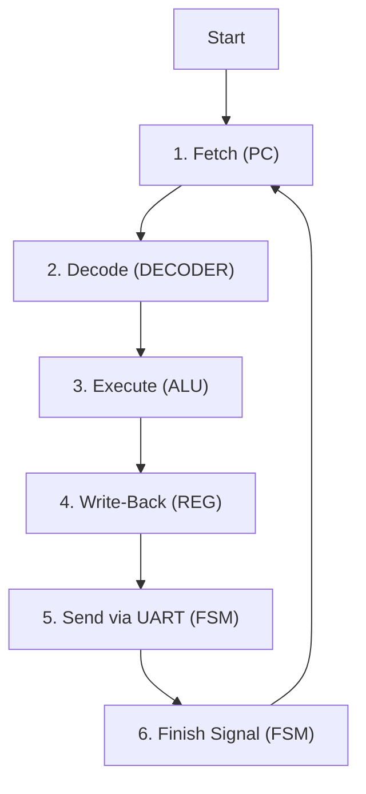

# 💻 Simple Verilog CPU 

이 프로젝트는 Verilog HDL을 사용하여 설계된 간단한 8비트 CPU입니다. 사용자가 직접 제어하는 **Manual 모드**와 프로그램에 따라 자동으로 명령어를 실행하는 **CPU 모드**를 지원하며, 모든 연산 결과는 UART 통신을 통해 외부로 출력됩니다.

## 사용 보드 
Digilent BASYS 3


### <a href="https://digilent.com/reference/programmable-logic/basys-3/start">Digilent Basys3</a>
   * AMD Artix™ 7 FPGA Trainer Board
   * Features
      * On-chip analog-to-digital converter
   * Key Specifications
      * FPGA Part # XC7A35T-1CPG236C
      * Logic Cells 33,280 in 5200 slices
      * Block RAM 1,800 Kbits
      * DSP Slices 90
      * Internal clock 450 MHz+
   * Connectivity and Onboard I/O
      * Pmod Connectors 3
      * Switches 16
      * Buttons 5
      * User LED 16
      * 7-Seg Display 4-Digit
      * VGA 12-bit
      * USB HID Host (KB/Mouse/Mass Storage)
   * Electrical
      * Power USB 5v (Pins)
      * Logic Level 3.3v

## ✨ 주요 특징

- **듀얼 모드 지원**: `Manual 모드`와 `CPU 모드`를 스위치로 전환할 수 있습니다.
- **UART 출력**: CPU의 모든 연산 결과는 9600bps의 UART 통신을 통해 실시간으로 전송됩니다.
- **파이프라인 구조**: 명령어 `Fetch` -> `Decode` -> `Execute` -> `Write-Back`의 기본적인 CPU 파이프라인 구조를 따릅니다.
- **동기화 설계**: FSM(Finite State Machine)이 CPU의 모든 동작(PC, 레지스터 쓰기 등)을 제어하여 안정적인 순차 실행을 보장합니다.

##  diagrama 🧱 아키텍처

### 블록 다이어그램 (Block Diagram)

CPU의 전체적인 하드웨어 구조입니다. 각 모듈이 어떻게 연결되어 상호작용하는지 보여줍니다.

```text
+---------------------------------------------------------------------------------+
| CPU Core (jsilicon.v)                                                           |
|                                                                                 |
|   +-----------------+         +-----------------+        +--------------------+ |
|   | Manual Inputs   |-------->|   SWITCH.V      |------->|       ALU.V        | |
|   | (ui_in, uio_in) |         | (Input Switch)  |        | (Arithmetic Logic) | |
|   +-----------------+         +-------+---------+        +----------+---------+ |
|                                       ^                             |           |
|   +-----------------+                 |                             |           |
|   |   PC.V & ROM    |--instr-+        | R0 Data                     | alu_result|
|   +-----------------+        |        |                             |           |
|                              v        +                             v           |
|   +-----------------+   +----+--------+----+         +--------------+-----------+ |
|   |   DECODER.V     |-->|   REGFILE.V      |<--------|      Write-Back Logic    | |
|   | (Decoder)       |   | (R0, R1)         |         |                          | |
|   +-----------------+   +------------------+         +--------------------------+ |
|           |                                                       |               |
|           |                                                       | wb_data       |
|           |                                                       v               |
|           | Control Signals                             +---------+----------+    |
|           +-------------------------------------------->|       FSM.V        |    |
|                                                         | (Controller)       |    |
|                                                         +---------+----------+    |
|                                                                   | uart_start    |
|                                                                   v               |
|                                                         +---------+----------+    |
|                                                         |      UART_TX       |    |
|                                                         |      (uart.v)      |    |
|                                                         +--------------------+    |
|                                                                   | Serial Out    |
+-------------------------------------------------------------------+---------------+
                                                                    |
                                                                    v
                                                                [Terminal]
```

### 동작 순서도 (Flowchart)

CPU 모드에서 하나의 명령어가 처리되는 과정입니다.



## ⚙️ 동작 원리

### 1. CPU 모드 (Fetch-Decode-Execute Cycle)
1.  **Fetch**: `PC`가 프로그램 메모리(ROM)에서 현재 주소에 해당하는 명령어를 가져옵니다.
2.  **Decode**: `DECODER`가 명령어를 해석하여 ALU, 레지스터 파일 등에 필요한 제어 신호를 생성합니다.
3.  **Execute**: `ALU`가 제어 신호에 따라 덧셈, 뺄셈 등의 산술/논리 연산을 수행합니다.
4.  **Write-Back**: 연산 결과가 `레지스터 파일` (R0 또는 R1)에 저장됩니다.
5.  **UART Send**: 동시에 `FSM`이 해당 결과를 `UART_TX` 모듈을 통해 외부로 전송합니다.
6.  **Sync**: `FSM`이 모든 과정이 끝났다는 `instruction_finished` 신호를 보내면, `PC`가 주소를 1 증가시키고 다음 사이클을 시작합니다.

### 2. Manual 모드 (Manual Mode)
CPU 모드와 달리, 사용자가 외부 입력핀(`ui_in`, `uio_in`)을 통해 직접 연산자와 피연산자를 제어하는 모드입니다. `mode` 핀이 0일 때 활성화됩니다.

1. **입력**: 사용자가 `ui_in`으로 두 개의 4비트 숫자, `uio_in`으로 3비트 `opcode`를 입력합니다.
2. **선택**: `SWITCH` 모듈이 CPU의 내부 값 대신 사용자의 입력을 선택하여 `ALU`로 전달합니다.
3. **실행 및 출력**: `ALU`가 연산을 수행하고, 그 결과는 CPU 모드와 동일하게 UART를 통해 외부로 전송됩니다. 이를 통해 하드웨어의 각 연산(덧셈, 뺄셈 등)을 개별적으로 테스트해볼 수 있습니다.

### 3. 데이터 처리 과정
- **연산 명령어 (ADD, SUB 등)**: `DECODER`가 `alu_enable`을 켜면, `ALU`의 연산 결과가 레지스터에 저장되고 UART로 전송됩니다.
- **로드 명령어 (LDI)**: `DECODER`가 `alu_enable`을 끄면, `ALU`는 동작하지 않습니다. 대신 명령어에 포함된 숫자(상수)가 레지스터에 바로 저장되며, 이 값이 UART로 전송됩니다. (이 로직 덕분에 `LDI 5`를 실행했을 때 UART로 `0`이 아닌 `5`가 출력됩니다.)

### 4. UART 통신
- `FSM`은 하나의 명령어 처리가 끝날 때마다 `UART_TX` 모듈에 `start` 신호를 보냅니다.
- `UART_TX`는 전송할 8비트 데이터를 받아서, 직렬 통신 규칙에 맞게 Start Bit, Data Bits, Stop Bit를 차례대로 `uart_tx` 핀으로 내보냅니다.
- 통신 속도는 `uart.v` 모듈 내의 `CLOCK_DIV` 파라미터로 결정되며, 현재 **9600bps**로 설정되어 있습니다.

## 📂 파일 설명

| 파일명 | 설명 |
| --- | --- |
| `jsilicon.v` | **최상위 모듈**. CPU의 모든 구성요소(PC, Decoder, ALU 등)를 연결하고 전체 시스템을 구성합니다. |
| `pc.v` | **Program Counter & Instruction ROM**. 실행할 명령어들을 내장하고 있으며, `instruction_finished` 신호에 따라 다음 명령어를 출력합니다. |
| `inst.v` | **Instruction Decoder**. PC에서 받은 명령어를 해석하여 각 모듈에 필요한 제어 신호(opcode, reg_sel, alu_enable 등)를 생성합니다. |
| `regfile.v` | **Register File**. CPU의 작업 공간인 `R0`, `R1` 레지스터를 포함합니다. `opcode`에 따라 값을 저장하거나 읽습니다. |
| `alu.v` | **Arithmetic Logic Unit**. 덧셈, 뺄셈, 곱셈 등 실제 산술/논리 연산을 담당합니다. |
| `fsm.v` | **Finite State Machine**. CPU의 모든 동작을 지휘하는 **컨트롤 타워**입니다. 명령어 사이클을 동기화하고 UART 전송을 제어합니다. |
| `uart.v` | **UART Transmitter**. 8비트 병렬 데이터를 직렬 데이터로 변환하여 외부로 송신하는 역할을 합니다. |
| `switch.v` | **Input Switch**. `Manual 모드`와 `CPU 모드`의 입력 소스를 선택하여 ALU로 전달하는 스위치 역할을 합니다. |

## 🛠️ 사용 방법

1.  Verilog 프로젝트를 FPGA 보드에 업로드합니다.
2.  PC와 보드를 UART 통신으로 연결합니다.
3.  시리얼 터미널 프로그램(예: PuTTY, MobaXterm)을 열고, 9600bps 속도로 포트를 엽니다.
4.  CPU 모드에서 동작시키면, 터미널에 명령어 처리 결과가 실시간으로 출력됩니다.
-------
참고 자료

https://github.com/gotree94/JSilicon

https://github.com/mirseo


