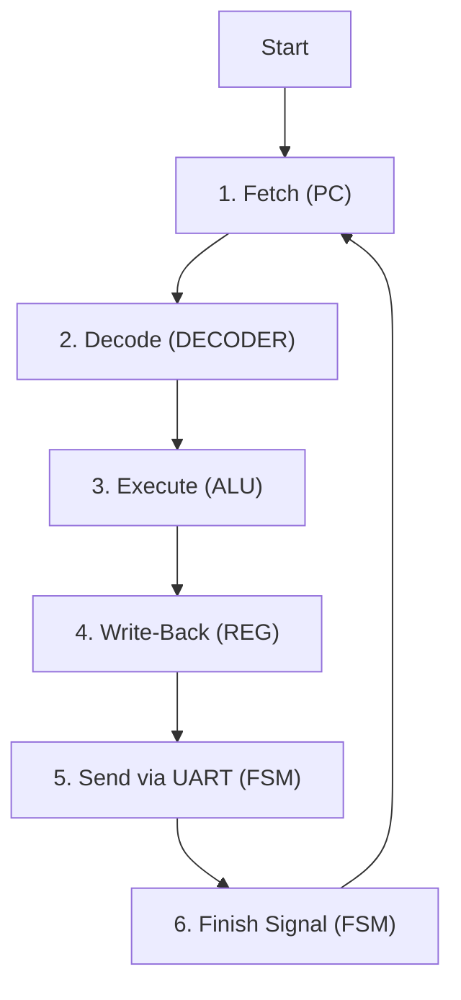

# ⚙⚙⚙ Verilog CPU 최종 기술 메뉴얼 (Definitive Technical Manual)

## 1. 프로젝트 개요

이 문서는 Verilog HDL로 설계된 8비트 Simple CPU의 아키텍처, 각 구성 모듈의 상세 설계, 그리고 전체 시스템의 데이터 흐름을 완벽하게 이해하는 것을 목표로 하는 기술 백서이다.

본 CPU는 3가지 주요 동작 모드를 지원한다.
1.  **CPU 모드**: 내장된 프로그램을 순차적으로 실행하는 자동 실행 모드.
2.  **Manual 모드**: 외부 스위치 입력을 통해 ALU의 기능을 수동으로 테스트하는 모드.
3.  **UART RX 모드**: PC 등 외부 기기로부터 실시간으로 명령을 받아 처리하는 원격 제어 모드.

---

## 2. ⠀⠀⠀ 아키텍처 및 동작 흐름

### 2.1. 전체 시스템 블록 다이어그램

CPU의 전체적인 하드웨어 구조. 각 모듈이 어떻게 연결되어 상호작용하는지 보여준다.

```text
+---------------------------------------------------------------------------------+
| CPU Core (jsilicon_uart_rx.v)                                                   |
|                                                                                 |
|   +-----------------+         +----------------------+   +--------------------+ |
|   | Manual Inputs   |-------->|  SWITCH_uart_rx.v    |-->|       ALU.V        | |
|   | (ui_in, uio_in) |         |    (Input Switch)    |   | (Arithmetic Logic) |
|   +-----------------+         +----------+-----------+   +----------+---------+ |
|                                          ^                          |           |
|   +-----------------+                    | R0 Data                  | alu_result|
|   |   PC.V & ROM    |--instr-+           |                          |           |
|   +-----------------+        |           +                          v           |
|                              v           |           +--------------+-----------+ |
|   +-----------------+   +----+-----------+----+      |      Mux & Logic         | |
|   |   DECODER.V     |-->|   REGFILE.V       |<-----|   (data_for_fsm, wb_data)  | |
|   | (Decoder)       |   |    (R0, R1)       |      +--------------+-----------+ |
|   +-----------------+   +-------------------+
|           |                                                       | data_for_fsm  |
|           | Control Signals                                       v               |
|           +-------------------------------------------->|       FSM.V        |    |
|                                                         | (Controller)       |    |
|   +-----------------+   +-----------------+             +---------+----------+    |
|   |   UART_RX.V     |-->|  CMD_PARSER.V   |---------------------->|                |    |
|   | (Receiver)      |   | (Command Parser)|             |         ^          |    |
|   +-----------------+   +-----------------+             +---------|----------+    |
|                                                                   | uart_tx       |
+-------------------------------------------------------------------+---------------+
```

### 2.2. CPU 모드 동작 순서도 (Flowchart)

CPU 모드에서 하나의 명령어가 처리되는 과정이다.



---

## 3. ⠀⠀⠀ 모듈별 상세 분석

### 3.1. `jsilicon_uart_rx.v`: 최상위 모듈

- **역할**: CPU의 모든 부품을 조립하고 연결하는 '메인보드'. 모든 데이터 흐름과 제어 신호가 이곳을 거쳐간다.
- **포트 설명**:
    - `clk_in1`, `rst_n`: 시스템의 기본 클럭과 리셋 신호.
    - `ui_in`, `uio_in`: Manual/모드 선택을 위한 16개의 외부 스위치 입력.
    - `uart_rx_pin`: PC로부터 UART 데이터를 수신하는 핀.
    - `uo_out`, `uio_out`: LED 및 UART 송신(`uart_tx`) 신호를 외부로 내보내는 출력 핀.
- **내부 동작 및 데이터 흐름**:
    1.  `uio_in[4:3]` 입력을 2비트 `mode` 신호로 정의하여 3가지 모드 중 하나를 결정한다.
    2.  `UART_RX`와 `CMD_PARSER`를 연결하여, `uart_rx_pin`으로 들어온 직렬 데이터를 4바이트 단위의 완전한 명령어로 만든다.
    3.  `PC`와 `DECODER`를 연결하여, CPU 모드에서 사용할 명령어를 해석하고 제어 신호를 생성한다.
    4.  `SWITCH` 모듈에 `Manual`, `CPU`, `UART` 세 가지 소스의 데이터를 모두 전달하고, `mode` 신호에 따라 그중 하나를 선택하여 `ALU`로 보내게 한다.
    5.  `ALU`의 결과(`alu_result`)와 `DECODER`의 정보(`wb_data`)를 조합하여, FSM으로 보낼 최종 데이터(`data_for_fsm`)를 결정한다.
- **핵심 설계 의도**:
    - **Why `data_for_fsm`?**: `LDI` 명령어처럼 ALU를 사용하지 않는 경우, ALU의 결과(0)가 아닌 명령어의 숫자값(`wb_data`)을 UART로 보내야 한다. 반면 UART 모드에서는 순수한 ALU의 결과(`alu_result`)를 보내야 한다. 이처럼 모드에 따라 FSM이 전송할 데이터가 달라지기 때문에, 이 둘을 선택해주는 Mux 로직이 필요하다.
    ```verilog
    assign data_for_fsm = (mode == 2'b01) ? wb_data : alu_result[7:0];
    ```

### 3.2. `fsm.v`: 유한 상태 머신 (지휘자)

- **역할**: CPU의 모든 동작 타이밍을 지휘하는 '컨트롤 타워'. 이 모듈이 없으면 모든 부품이 제멋대로 동작하여 시스템이 붕괴된다.
- **포트 설명**:
    - `ena`: FSM을 `IDLE` 상태에서 깨우는 트리거 신호.
    - `wb_data_in`: UART로 전송할 8비트 데이터.
    - `uart_busy`: UART 송신기가 현재 바쁜지 알려주는 상태 신호.
    - `instruction_finished`: CPU 모드에서 한 사이클이 끝났음을 `PC`에 알리는 신호.
    - `uart_tx`: `UART_TX` 모듈의 최종 출력 신호.
- **내부 동작 상세 분석**:
    1.  **`IDLE` 상태**: 평소에 머무는 대기 상태. `ena` 신호가 1이 되는 것을 감지하면, 그 즉시 `wb_data_in` 값을 내부 `result_reg`에 저장하고 `EXECUTE` 상태로 넘어간다.
    2.  **`EXECUTE` 상태**: `UART_TX` 모듈에게 전송을 시작하라는 `start_uart` 신호를 1로 만들고, `SEND` 상태로 넘어간다.
    3.  **`SEND` 상태**: `UART_TX`가 전송을 시작하여 `uart_busy`가 1이 될 때까지 기다린다.
    4.  **`WAIT` 상태**: `uart_busy`가 다시 0 (전송 완료)이 될 때까지 기다린다. 완료되면 다시 `IDLE` 상태로 돌아가 다음 명령을 준비한다.
- **핵심 설계 의도**:
    - **Why State Machine?**: Fetch, Decode, Execute, TX 등 여러 단계로 이루어진 작업을 순서대로 처리하기 위해 상태 머신은 필수적이다. 각 상태는 작업의 한 단계를 책임진다.
    - **Why latch in `IDLE`?**: `ena` 신호는 단 한 클럭만 유지된다. `ALU`의 결과값도 이 때만 유효하다. 만약 `EXECUTE` 상태로 넘어간 *다음* 클럭에 값을 저장하려 하면, 이미 `ALU`의 결과값은 0으로 변해버린 후이다. 이 타이밍 문제를 해결하기 위해, `ena`가 감지된 **바로 그 순간**에 값을 채가는 것이다.

### 3.3. `cmd_parser.v`: 원격 명령어 조립기

- **역할**: `UART_RX`가 한 바이트씩 물어다 주는 데이터를 모아서, 4바이트 단위의 완전한 원격 명령어로 조립하는 '조립 라인'.
- **포트 설명**:
    - `uart_data_in`, `uart_data_ready`: `UART_RX`로부터 받은 데이터와 수신 완료 신호.
    - `uart_a`, `uart_b`, `uart_opcode`: 조립이 완료된 명령어의 각 부분.
    - `cmd_ready`: 4바이트 조립이 모두 끝나 FSM에 "실행하라"고 알리는 신호.
- **내부 동작 상세 분석**:
    1.  **`IDLE` 상태**: `uart_data_ready` 신호가 들어올 때마다 수신된 데이터를 확인한다. 만약 이 값이 약속된 `START_BYTE(0xFE)`와 일치하면, `WAIT_A` 상태로 넘어간다. 다른 모든 값은 무시한다.
    2.  **`WAIT_A` 상태**: 데이터가 들어오면 `uart_a`에 저장하고 `WAIT_B` 상태로 넘어간다.
    3.  **`WAIT_B` 상태**: 데이터가 들어오면 `uart_b`에 저장하고 `WAIT_OPCODE` 상태로 넘어간다.
    4.  **`WAIT_OPCODE` 상태**: 데이터가 들어오면 `uart_opcode`에 저장하고 `EXECUTE` 상태로 넘어간다.
    5.  **`EXECUTE` 상태**: `cmd_ready` 신호를 한 클럭 동안 `1`로 만들어 FSM을 트리거하고, 즉시 `IDLE` 상태로 돌아가 다음 `START_BYTE`를 기다린다.
- **핵심 설계 의도**:
    - **Why `START_BYTE`?**: PC가 보내는 데이터 외에, 터미널의 엔터키(`\n`) 등 예상치 못한 데이터가 끼어들면 3바이트씩 끊어 읽는 동기화가 깨진다. `START_BYTE`는 이런 노이즈를 모두 무시하고, 오직 약속된 시작점에서만 명령어 해석을 시작하게 하여 통신의 안정성을 비약적으로 높여준다.

### 3.4. 그 외 모듈

- **`pc.v`**: CPU 모드에서 `FSM`의 `instruction_finished` 신호를 받을 때마다 주소를 1씩 증가시켜, 내장된 다음 명령어를 `DECODER`에 전달한다.
- **`inst.v`**: `PC`의 8비트 명령어를 `alu_opcode`, `operand` 등 여러 제어 신호로 분해하여 각 모듈에 전달하는 '번역기'.
- **`regfile.v`**: `FSM`의 `instruction_finished` 신호가 들어올 때만, `DECODER`가 지정한 레지스터(`R0` 또는 `R1`)에 `wb_data`를 저장하는 '임시 저장소'.
- **`alu.v`**: `SWITCH`가 선택한 `a`, `b`, `opcode`를 받아, `alu_ena`가 1일 때만 산술/논리 연산을 수행하는 '계산기'.
- **`switch_uart_rx.v`**: 2비트 `mode` 신호에 따라 `Manual`, `CPU`, `UART` 세 가지 입력 소스 중 하나를 선택하여 `ALU`로 전달하는 '교통정리 경찰'.
- **`uart_rx.v` / `uart.v`**: 각각 직렬 통신의 '수신기'와 '송신기'. 비트 단위의 저수준 통신을 담당한다.
